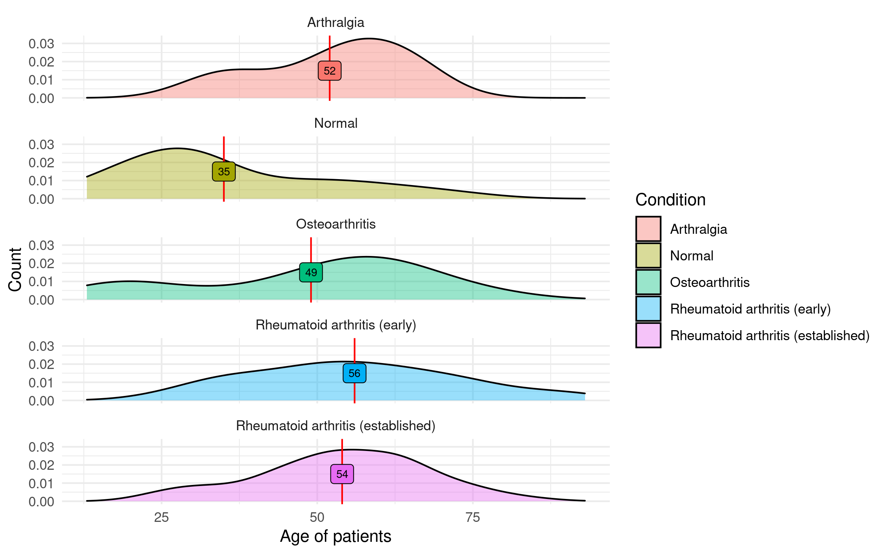
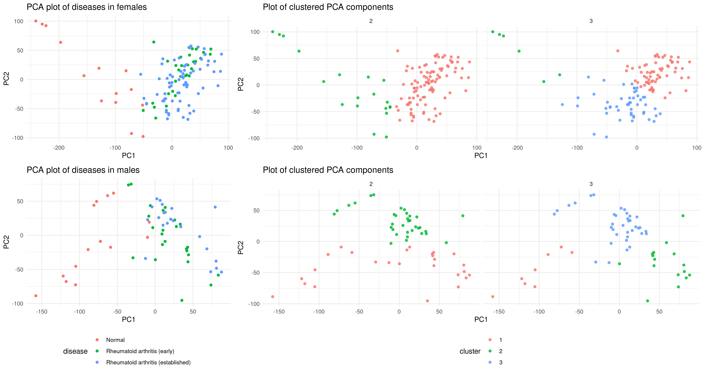
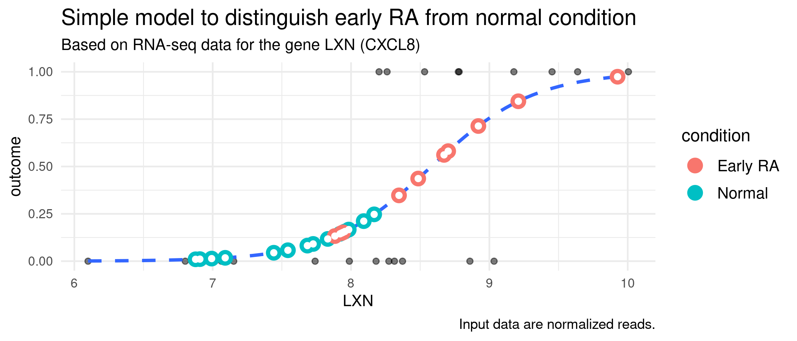

```{r setup, include=FALSE}
knitr::opts_chunk$set(echo = FALSE,
                      message = FALSE,
                      warning = FALSE,
                      dev.args=list(bg="transparent"))
```

```{r libraries}
library("tidyverse")
```

## 1. Introduction


Why we wanted to look at arthritis, what we wanted to find out, how we were going to do it (in very broad terms), bla bla bla bla.

## 2. Materials and methods

Explain the dataset and articles
Explain the order we did things

## 3. Tidy datasets

```{r cars, echo = TRUE}
summary(cars)
```

## 4. Results 1: Exploration of Metadata (Klara)

```{r, out.width='750px'}

```

## 5. Results 2: PCA and clusters (Klara) 

```{r, out.width='900px'}

```

---

```{r, fig.dim=c(10,6)}
all_logfold <- read_tsv(file = "../data/03_combined_log2fc.tsv")
diff_expr_genes <- read_tsv(file = "../data/08_diff_expr_genes.tsv")

all_logfold %>% 
  left_join(diff_expr_genes, by = "gene") %>%
  mutate(differentiation = fct_relevel(differentiation, 
                                       c("Healthy vs. Pre treatment",
                                         "Healthy vs. Post Treatment",
                                         "Pre vs. Post Treatment"
                                       ))) %>% 
  ggplot(mapping = aes(x = gene, 
                       y = log2FoldChange,
                       color = factor(significant),
                       fill = factor(diff_expr))) + 
  geom_point(alpha = 0.4, shape = 21) +
  scale_color_manual(values = c("black", "dodgerblue3"), na.translate = F) +
  scale_fill_manual(values = c("under" = "brown1", "over" = "chartreuse"), na.translate = F) +
  theme_minimal(base_family = "Avenir",
                base_size = 10) +
  labs(x = "Gene", 
       y = "log2 Fold Change",
       fill = "Differential expression",
       color = "Adjusted p < 0.05",
       title = "6. Results 3: Differential expression analysis") +
  lims(y = c(-15,15)) +
  theme(legend.position = "bottom",
        axis.text.x=element_blank(),
        panel.grid.major=element_blank(),
        panel.grid.minor=element_blank()) +
  facet_grid(rows = vars(differentiation))


```

## 7. Results 4: Heatmaps (Javi)

```{r}
plot(pressure)
```

## 8. Results 5: Box plots (Javi)

```{r}
plot(pressure)
```

## 9. Results 6: Model (Angeliki)

```{r}

```

## 10. Discussion + conclusion (Angeliki)

```{r}
plot(pressure)
```

## Goodbye- slide


