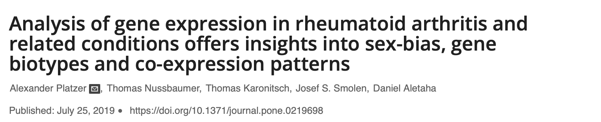

<style type="text/css">
slides > slide:not(.nobackground):after {
  content: '';
}
</style>


```{r setup, include=FALSE}
knitr::opts_chunk$set(echo = FALSE,
                      message = FALSE,
                      warning = FALSE,
                      dev.args=list(bg="transparent"))
```

```{r libraries}
library("tidyverse")
```

## 1. Introduction

Rheumatism - biomechanics
12 % of Danish population


## 2. Materials and methods

Explain the dataset and articles
Explain the order we did things
```{r, out.width='750px'}

```
## 3. Data wrangling and tidying

```{r cars, echo = TRUE}
summary(cars)
```

## 4. Results 1: Exploration of Metadata (Klara)

```{r, out.width='750px'}
knitr::include_graphics('../results/age_distr_plot.png')
```

## 5. Results 2: PCA and clusters (Klara) 

```{r, out.width='900px'}
knitr::include_graphics('../results/pcas.png')
```

## 6. Results 3: Differential expression analysis {#log1}

<style>
    #log1 > p {
      margin-top: -50px;
    }
</style>

```{r, fig.dim=c(10,6)}
all_logfold <- read_tsv(file = "../data/03_combined_log2fc.tsv")
diff_expr_genes <- read_tsv(file = "../data/08_diff_expr_genes.tsv")

p <- all_logfold %>% 
  left_join(diff_expr_genes, by = "gene") %>%
  mutate(differentiation = fct_relevel(differentiation, 
                                       c("Healthy vs. Pre treatment",
                                         "Healthy vs. Post Treatment",
                                         "Pre vs. Post Treatment"
                                       ))) %>% 
  ggplot(mapping = aes(x = gene, 
                       y = log2FoldChange,
                       color = factor(significant))) + 
  geom_point(alpha = 0.4, 
             shape = 21) +
  scale_color_manual(values = c("black", 
                                "dodgerblue3"), 
                     na.translate = F) +
  scale_fill_manual(values = c("under" = "brown1",
                               "over" = "chartreuse"),
                    labels = c("Under","Over"),
                    na.translate = F) +
  theme_minimal(base_family = "Avenir",
                base_size = 10) +
  labs(x = "Gene", 
       y = "log2 Fold Change",
       fill = "Differential Expression",
       color = "Adjusted p < 0.05") +
  lims(y = c(-8,8)) +
  theme(legend.position = "bottom",
        axis.text.x=element_blank(),
        panel.grid.major=element_blank(),
        panel.grid.minor=element_blank()) +
  facet_grid(rows = vars(differentiation))
p

```

## 6. Results 3: Differential expression analysis {#log2}

<style>
    #log2 > p {
      margin-top: -50px;
    }
</style>

```{r, fig.dim=c(10,6)}
p + 
  aes(x = gene,
        y = log2FoldChange,
        color = factor(significant),
        fill = factor(diff_expr)) +
  labs(x = "Gene", 
       y = "log2 Fold Change",
       fill = "Differential Expression",
       color = "Adjusted p < 0.05")
  
```

## 7. Results 4: Heatmaps (Javi)

```{r}
plot(pressure)
```

## 8. Results 5: Box plots (Javi)

```{r}
plot(pressure)
```

## 9. Results 6: Model (Angeliki)

```{r}
knitr::include_graphics('../results/final_model_LXN_curve.png')
```

## 10. Discussion + conclusion (Angeliki)

identified significant differences in gene expression between early RA and healthy synovial tissue
expression of some genes reversed after tDMARD
these results give insight into the action mechanism or the drug
no follow up on patient condition
not repoducible data, and why its important
sampling design and batch effect

## Goodbye- slide


