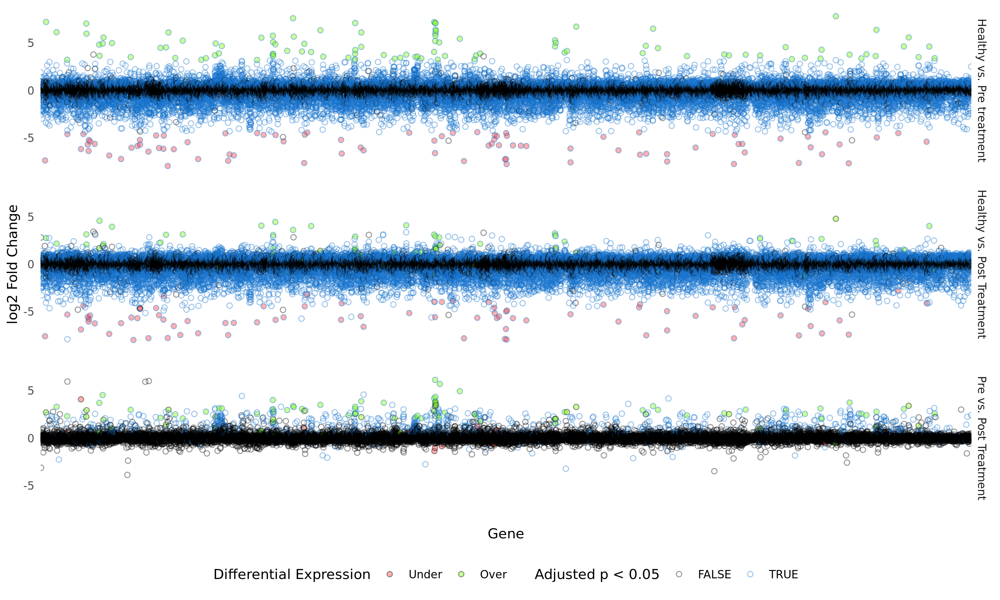

<style type="text/css">
slides > slide:not(.nobackground):after {
  content: '';
}
</style>

<style>
    #log1 > p {
      margin-top: -50px;
    }
    #log2 > p {
      margin-top: -50px;
    }
</style>


```{r setup, include=FALSE}
knitr::opts_chunk$set(echo = FALSE,
                      message = FALSE,
                      warning = FALSE,
                      dev.args=list(bg="transparent"))
```

```{r libraries}
library("tidyverse")
```

## 1. Introduction


Why we wanted to look at arthritis, what we wanted to find out, how we were going to do it (in very broad terms), bla bla bla bla.

## 2. Materials and methods

Explain the dataset and articles
Explain the order we did things

## 3. Tidy datasets

```{r cars, echo = TRUE}
summary(cars)
```

## 4. Results 1: Exploration of Metadata (Klara)

```{r, out.width='750px'}
knitr::include_graphics('../results/age_distr_plot.png')
```

## 5. Results 2: PCA and clusters (Klara) 

```{r, out.width='900px'}
knitr::include_graphics('../results/pcas.png')
```

## 6. Results 3: Differential expression analysis {#log1}


```{r, out.width="950px"}
knitr::include_graphics('../results/diff_expr.png')
```

## 6. Results 3: Differential expression analysis {#log2}

```{r, out.width="950px"}

```


## 7. Results 4: Heatmaps (Javi)

```{r}
plot(pressure)
```

## 8. Results 5: Box plots (Javi)

```{r}
plot(pressure)
```

## 9. Results 6: Model (Angeliki)

```{r}
knitr::include_graphics('../results/final_model_LXN_curve.png')
```

## 10. Discussion + conclusion (Angeliki)

identified significant differences in gene expression between early RA and healthy synovial tissue
expression of some genes reversed after tDMARD
these results give insight into the action mechanism or the drug
no follow up on patient condition
not repoducible data, and why its important
sampling design and batch effect

## Goodbye- slide


