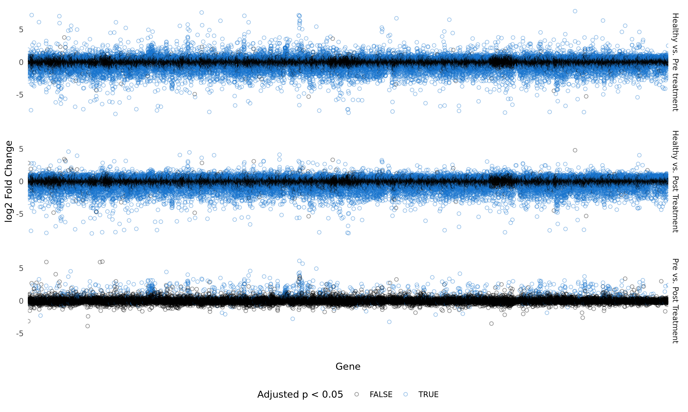

<style type="text/css">
slides > slide:not(.nobackground):after {
  content: '';
}
</style>

<style>
    #log1 > p {
      margin-top: -50px;
    }
    #log2 > p {
      margin-top: -50px;
    }
</style>


```{r setup, include=FALSE}
knitr::opts_chunk$set(echo = FALSE,
                      message = FALSE,
                      warning = FALSE,
                      dev.args=list(bg="transparent"))
```

```{r libraries}
library("tidyverse")
```

## 1. Introduction

Rheumatism - biomechanical disorder(s)

12% of Danish population

Good treatment options, but little insight on mechanism of action


## 2. Materials and methods


```{r, out.width='1000px'}
knitr::include_graphics('/cloud/project/doc/Article_flow.png')
```

## 3. Data tidying
A column per variable
A row per observation
A cell per value

## 4. Results 1: Exploration of Metadata (Klara)
```{r,out.width='450px'}
knitr::include_graphics('/cloud/project/results/04_age_distribution.png')
```
```{r, out.width='500px'}
knitr::include_graphics('/cloud/project/results/04_sex_distribution.png')
```


## 5. Results 2: PCA and k-means clustering

```{r, out.width='900px'}
knitr::include_graphics('/cloud/project/results/pcas.png')
```

## 6. Results 3: Differential expression analysis {#log1}


```{r, out.width="950px"}


```

## 6. Results 3: Differential expression analysis {#log2}

```{r, out.width="950px"}
knitr::include_graphics('/cloud/project/results/08_diff_expr_marked.png')
```

## 7. Results 4: Heatmaps (Javi)

```{r, out.width='460px'}
knitr::include_graphics('/cloud/project/results/07_heatmap_over.png')
knitr::include_graphics('/cloud/project/results/07_heatmap_under.png')
```

## 8. Results 5: Box plots (Javi)

```{r}
plot(pressure)
```

## 9. Results 6: Model (Angeliki)

```{r}
knitr::include_graphics('/cloud/project/results/final_model_LXN_curve.png')
```

## 10. Discussion + conclusion (Angeliki)

identified significant differences in gene expression between early RA and healthy synovial tissue
expression of some genes reversed after tDMARD
these results give insight into the action mechanism or the drug
no follow up on patient condition
not repoducible data, and why its important
sampling design and batch effect

## Goodbye- slide

## References


